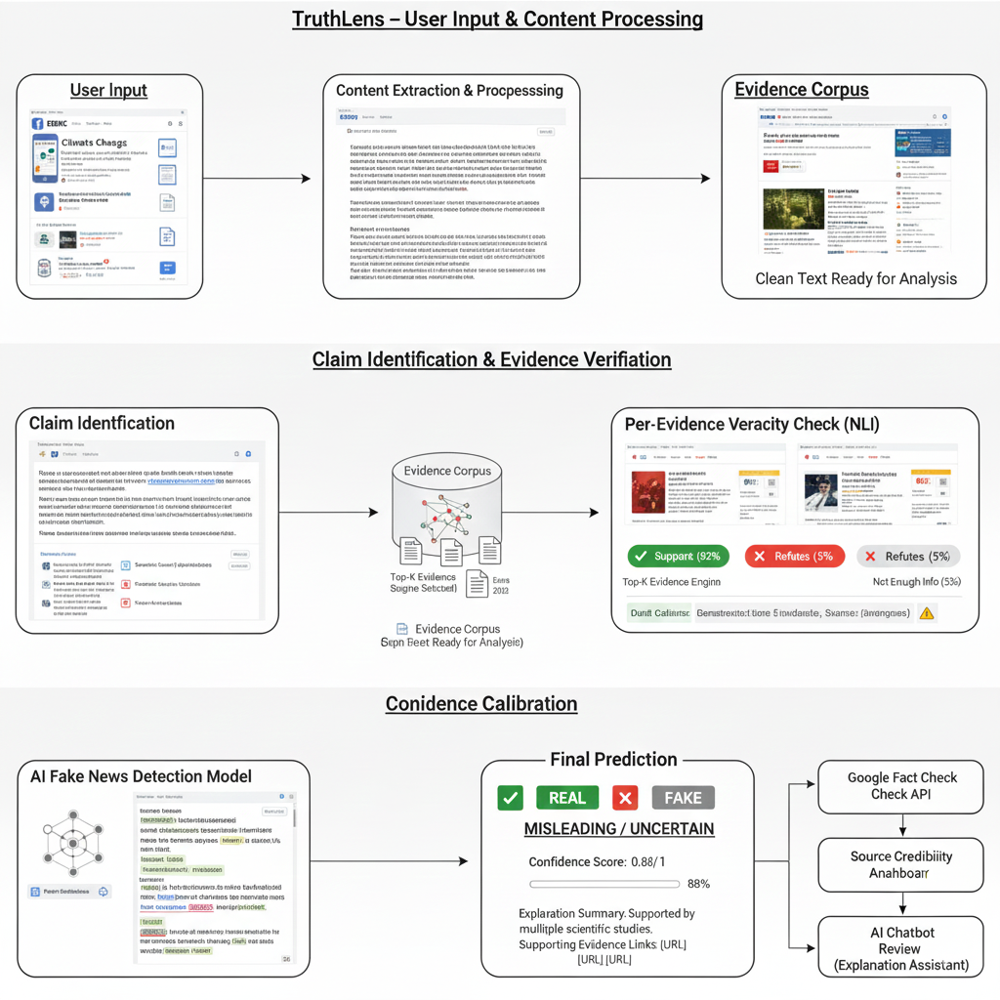

# 🕵️‍♀️ TruthLens Campus

**AI-Assisted Misinformation Detection & Learning Platform for Students and Local Communities**

## 🌟 Inspiration

In today's digital-first campus environment, students rely heavily on WhatsApp groups, Telegram channels, emails, Instagram posts, and online portals for critical information such as:

- Placements & internships
- Scholarships & exams
- Events & official notices
- Local and campus-specific news

Unfortunately, misinformation spreads faster than verification.

Fake placement messages, manipulated posters, false circulars, and misleading links often cause:

- Panic and confusion
- Financial scams
- Missed academic or career opportunities
- Loss of trust within student communities

We built TruthLens Campus to help students verify information and learn how misinformation works, before believing or sharing it.

## 🎯 Problem Statement

There is no dedicated, easy-to-use platform focused on campus and local-community misinformation.

Most existing fact-checking tools are:

- Generic and not student-focused
- Designed for journalists, not learners
- Slow or difficult to interpret
- Lacking transparent explanations

Students need a system that:

- Works quickly
- Explains why content may be misleading
- Supports multiple content formats
- Encourages responsible digital behavior

## 💡 Our Solution

TruthLens Campus is a web-based, AI-assisted verification and learning platform designed specifically for students and local communities.

Users can submit:

- 📝 Text messages
- 🔗 URLs or articles
- 🖼️ Images (posters, screenshots)
- 📄 Documents (PDF notices, circulars)

The system analyzes the content using AI reasoning and provides:

- ✅ Verdict: Likely Real / Likely Fake / Partially True
- 📊 Confidence Score
- 🧠 Human-readable explanation
- 🔍 Contextual insights

Instead of acting as a black-box detector, TruthLens focuses on explainability and learning.

## 🎓 Learning-Focused Design (E-Techh Hacks Alignment)

TruthLens Campus is not just a detection tool — it is a learning platform.

- Helps students understand why information is misleading
- Improves critical thinking and media literacy
- Encourages responsible information sharing
- Demonstrates real-world application of AI for social good

This directly aligns with E-Techh Hacks' theme: **"Anything for Learning."**

## ✨ Key Features

### 🔍 Multi-Modal Verification
- Text & message analysis
- URL and article credibility checks
- Image authenticity assessment
- PDF & document evaluation

### 🤖 AI-Assisted Reasoning
- Context-aware content understanding
- Natural language explanations
- Confidence-based classification

### 🧠 Explainable AI
- Clear reasoning behind each verdict
- Transparent decision process
- Focus on awareness, not fear

### 🔐 Secure & Scalable
- Secure authentication
- Cloud-based architecture
- Designed for future extension

### 🌐 Community-Centric Design
- Optimized for campus use cases
- Simple UI for non-technical users
- Practical real-world adoption

## 🆚 What Makes TruthLens Campus Different?

- Focused on campus & local misinformation, not global news
- Explainable AI instead of black-box verdicts
- Multi-format verification in one place
- Designed for students and learners, not journalists
- Learning-first approach over pure detection

## 🧩 Architecture & Processing Pipeline (Visual Explanation)

The diagrams below visually explain how TruthLens Campus processes content and produces an explainable credibility result.

### 🔹 Diagram 1: System Architecture Overview



**Purpose:** To show the complete system architecture from user input to final prediction.

**Flow:**
1. User submits content (text, URL, image, or PDF)
2. Content extraction and preprocessing occur
3. Key claims are identified
4. Evidence is retrieved from trusted sources
5. Natural Language Inference (NLI) evaluates each claim against evidence
6. AI classifier processes the results
7. Confidence calibration ensures reliable predictions
8. Final verdict with explanation is presented

### 🔹 Diagram 2: User Input & Content Processing


**Purpose:** To show how different types of content are handled uniformly.

**Flow:**
1. User submits content (text, URL, image, or PDF)
2. Content extraction and preprocessing occur
3. Text is cleaned, normalized, and structured
4. Prepared data moves to the verification stage

This ensures consistency across all content formats.

### 🔹 Diagram 3: Claim Identification & Evidence Verification


**Purpose:** To explain how the system understands what is being claimed.

**Flow:**
1. Key claims are identified from the content
2. Relevant supporting or contradicting information is retrieved
3. Each evidence item is evaluated independently
4. Natural Language Inference (NLI) logic determines whether evidence:
   - Supports the claim
   - Refutes the claim
   - Is insufficient or unclear

This modular design improves transparency and explainability.

### 🔹 Diagram 4: Confidence Calibration & Final Prediction

**Purpose:** To avoid overconfident or misleading AI outputs.

**Final Output Includes:**
- Verdict: Likely Real / Likely Fake / Partially True
- Confidence score (calibrated)
- Explanation summary
- Supporting contextual references

This helps users learn how conclusions are formed, not just see the result.

## 🏗️ System Architecture (Text Overview)

```
User Interface
    ↓
Content Input & Validation
    ↓
AI Reasoning & Verification Layer
    ↓
Explanation Generation
    ↓
Result Display
    ↓
Cloud Storage & Analytics
```

## 🧰 Tech Stack

### Frontend
- React.js
- TypeScript
- Tailwind CSS

### Backend & Cloud
- Node.js
- Firebase Authentication
- Firebase Firestore
- Firebase Hosting

### AI / Intelligence
- AI-based reasoning model (LLM-powered)

## 🚀 Getting Started

### Prerequisites
- Node.js (v18+)
- npm or yarn
- Firebase account
- AI API key

### Installation

1. Clone the repository:
```bash
git clone <repository-url>
cd truthlens-campus
```

2. Install dependencies:
```bash
npm install
```

3. Create a `.env` file:
```env
AI_API_KEY=your_api_key_here
VITE_FIREBASE_API_KEY=your_firebase_key
VITE_FIREBASE_PROJECT_ID=your_project_id
```

4. Run locally:
```bash
npm run dev
```

## 🎥 Demo & Deliverables

- 🎬 2–3 minute demo video
- 🖼️ Screenshots of verification results
- 📊 Pitch explaining problem, solution & impact
- 💻 Working prototype

## 🌍 Real-World Impact

- Reduces panic caused by false information
- Protects students from scams
- Builds trust within communities
- Encourages responsible digital habits
- Improves AI literacy

## 🚀 Future Scope

- 🌍 Multilingual verification
- 🤝 WhatsApp / Telegram bot integration
- 🧩 Browser extension
- 📊 Community credibility insights
- 🖼️ Advanced image forensics

## ⚠️ Ethical & Responsible AI Disclaimer

TruthLens Campus provides AI-assisted credibility insights intended to support learning and informed decision-making.

**It should not be treated as a definitive or authoritative source of truth.**

## 🧑‍🤝‍🧑 Team

Developed by a passionate student team as part of **TechSprint Hackathon 2025** organized by **GDG On Campus GGITS**

## 📜 License

This project is developed for educational, research, and hackathon purposes.

## 🏁 Final Note

TruthLens is not just a project — it is a step toward safer, smarter, and more trustworthy student communities.
